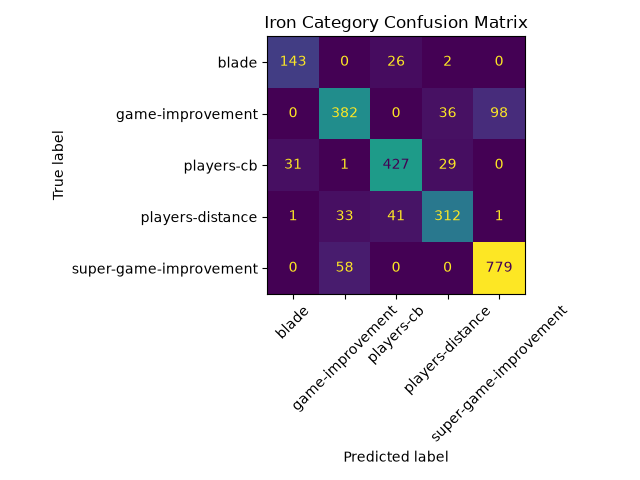

# AI Golf Club Recommendation System
 
A Flask web app that predicts a golfer's fitting specifications from their swing profile, then ranks real clubs from an equipment database to match. Built with Python, scikit-learn, and a vanilla JavaScript front end.
 
**Stack:** Python · scikit-learn · Flask · pandas · NumPy · Matplotlib · pytest
 


## Problem Statement
 
Golfers often buy clubs based on brand reputation, advertising, or simple rules of thumb. That approach ignores the interaction between swing speed, handicap, carry distance, shot shape, trajectory, budget, and the golfer's main goal. This project builds a machine-learning web app that predicts fitting specifications for a golfer and then recommends real clubs from a golf equipment database.
 
The system predicts:
 
- Recommended driver loft
- Recommended shaft flex
- Recommended fairway wood loft
- Recommended iron category
- Recommended wedge bounce
After prediction, it searches the included equipment JSON database and ranks the top recommendations for all four club categories, each with an explanation for the match.
 
## Why This Requires AI
 
A traditional rule-based program could say "if swing speed is under 85 mph, use senior flex." That is too rigid for realistic fitting because multiple golfer traits interact. For example, a mid-speed golfer with a high handicap and a forgiveness goal may need a different setup than a similar-speed golfer focused on distance and accuracy.
 
This project uses supervised machine learning to learn fitting patterns from a synthetic dataset. The labels are still grounded in published fitting guidelines, but the model learns from combinations of inputs and includes about 10 percent label noise so the dataset is not perfectly rule-based.
 
## Software Engineering Relevance
 
The project demonstrates common software engineering practices:
 
- Data ingestion from JSON files
- Synthetic dataset generation
- Model training and evaluation
- Modular code organization
- Automated tests
- A custom Flask web interface
- Reproducible setup through `requirements.txt`
- Separation between prediction logic and recommendation ranking
## Dataset
 
The equipment catalog is stored in:
 
```text
data/equipment/data/
```
This dataset was taken from [golf-equipment-database](https://github.com/golferx/golf-equipment-database) by Andrew Ajax.
It includes JSON records for drivers, shafts, fairway woods, hybrids, irons, wedges, and putters. Fairway woods (37 models) and wedges (29 models) now span every year from 2019 to 2026, hand-researched to add real, verifiable specs (lofts, bounce/grind options, MSRP) for models the original database didn't cover - anything without confirmed specs was left out rather than guessed. The synthetic golfer dataset is generated by `synthetic_data.py` and saved to:
 
```text
data/golfers.csv
```
 
Each generated golfer includes:
 
- Handicap
- Swing speed
- Driver carry distance
- Shot shape
- Goal
- Typical iron miss
- Preferred iron feel or look
- Typical turf/lie conditions (for wedge bounce)
- Typical divot depth (for wedge bounce)
- Driver loft label
- Shaft flex label
- Fairway wood loft label
- Iron category label
- Wedge bounce label
The label-generation rules are based on public fitting guidance from sources such as MyGolfSpy's driver shaft flex chart, LAZRUS Golf's driver loft guide, TaylorMade's game-improvement iron guidance, and PGA TOUR Superstore fitting education. Iron category labels are not based on handicap alone; they combine handicap, swing speed, carry distance, shot shape, primary goal, typical miss, and preferred feel/look. Fairway wood loft follows the same speed/handicap/goal logic as driver loft, recalibrated to fairway wood's finer loft steps. Wedge bounce combines stated turf/lie firmness with divot depth (an attack-angle proxy), weighted at least as heavily as turf, since a deep digger needs bounce even on firm ground and a shallow sweeper can get away with less even on soft ground.
 
Sources:
 
- [MyGolfSpy shaft flex chart](https://mygolfspy.com/news-opinion/instruction/golf-driver-shaft-flex-chart-find-the-right-flex-for-your-swing-speed/)
- [LAZRUS Golf driver loft guide](https://lazrusgolf.com/blogs/news/golf-driver-loft-chart)
- [TaylorMade game-improvement irons guidance](https://www.taylormadegolf.com/clubhouse/1286718-who-should-play-game-improvement-irons.html?lang=en_US)
- [PGA TOUR Superstore club fitting guide](https://www.pgatoursuperstore.com/learning-center/golf-club-fitting-guide.html)
## Machine Learning
 
The primary algorithm is Random Forest classification. Five separate models are trained, one per predicted label:
 
- `driver_loft_model.joblib`
- `shaft_flex_model.joblib`
- `fairway_wood_loft_model.joblib`
- `iron_category_model.joblib`
- `wedge_bounce_model.joblib`
Random Forest was chosen because it works well on tabular data, handles nonlinear feature interactions, needs little preprocessing, is robust to noisy labels, and is easier to explain than more complex neural-network approaches.
 
The training script evaluates each model using:
 
- Accuracy
- Confusion matrix
- Classification report
Current model performance. Balanced accuracy is the cross-validated figure and is the more meaningful number here, since the classes are uneven:
 
| Target | Accuracy | Balanced accuracy (CV) | Classes |
| --- | --- | --- | --- |
| Driver loft | 0.893 | 0.823 | 4 |
| Shaft flex | 0.873 | 0.830 | 5 |
| Fairway wood loft | 0.907 | 0.863 | 4 |
| Iron category | 0.750 | 0.635 | 5 |
| Wedge bounce | 0.907 | 0.898 | 3 |
 
Iron category is the hardest of the five. The model separates the extremes well but confuses the middle categories, since those overlap heavily in the source fitting guidance and are not cleanly separable. It also picked up the new divot-depth input, which it has no real signal for, costing it a little cross-validated accuracy without changing its predictions. Wedge bounce is the easiest label added: turf/lie condition and divot depth are direct, near-deterministic drivers of bounce need, so its three classes separate cleanly - and adding divot depth as a second input held its accuracy steady while making the underlying rule more realistic.
 

 
Full metrics, best hyperparameters, and classification reports are written to `models/metrics.json`. Confusion matrix images for all five models are in `models/`.
 
## Recommendation Algorithm
 
The AI models predict fitting specifications. Then `recommend.py` ranks equipment database records using a scoring algorithm based on:
 
- Swing speed compatibility
- Loft match
- Forgiveness
- Golfer goal
- Budget filter
- Launch characteristics
- Slice/draw-bias compatibility
- Whether the golfer currently hits the ball too high, too low, or about right
- Separate driver and iron shot-shape and goal answers
- Bounce and grind fit against stated turf/lie conditions (wedges)
- Sole-width fit against divot depth (wedges)
- Greenside shot-style fit against grind character (wedges)
- Bunker frequency fit against grind and wedge category (wedges)
- Workability fit against golfer goal (wedges)
The web app displays the top recommendations with match scores and short explanations. If the top 5 clubs all share the same match score, the display expands until it reaches the next lower score so the ranking is clearer.

Fairway woods share the driver's scoring logic entirely - same catalog schema, same fitting signals - just against a fairway-wood-appropriate loft target, so `score_driver` and `score_fairway_wood` are thin wrappers around one shared implementation. Wedges don't get a single predicted-loft target the way the other three categories do: real wedge fitting is a multi-club gapping decision (a golfer typically carries 2-3 wedges spanning a loft range), which is a different feature from what's implemented here. Wedge scoring instead ranks individual wedge models by bounce/grind fit, forgiveness, and workability, the same way every other category ranks individual products.

A trajectory complaint ("too high"/"too low") only means something relative to what a golfer already plays, so the driver, fairway wood, and iron questionnaires let the golfer optionally name their *current* driver/irons from the catalog. When that's known, launch/spin scoring targets one step off the golfer's *actual current* launch/spin bucket rather than the extreme end of the scale - a golfer already on a mid-launch driver who says their flight is too high gets steered toward a mildly-lower-launching head, not the single lowest-launch driver in the catalog, which risks overcorrecting them into "too low." Skipping the question falls back to the original absolute-target behavior.
 
## Web Questionnaire
 
The app asks shared questions first:
 
- What the golfer is shopping for: any combination of driver, fairway wood, irons, and wedges (all four checked by default)
- Handicap or average score
Driver and fairway wood questions are shown whenever either is requested - they reuse the same swing inputs, since a golfer's shot shape, trajectory, and goal don't change between the two:
 
- Current driver (optional) - lets trajectory scoring target one step off the golfer's actual launch/spin instead of the scale's extreme end
- Swing speed or driver carry distance
- Driver shot shape
- Driver trajectory: too high, too low, or about right
- Primary driver goal
- Per-category tab budget filter
- Per-category tab condition filter: All or Used
Iron questions are shown only when iron recommendations are requested:
 
- Current irons (optional) - same relative-trajectory role as the current driver question, above
- Iron shot shape
- Primary iron goal
- Iron trajectory: too high, too low, or about right
- Preferred feel or look
- Typical iron miss
- Iron tab budget filter
- Iron condition filter: All or Used
Wedge questions are shown only when wedge recommendations are requested:
 
- Typical turf/lie conditions: Firm, Normal, or Soft
- Typical divot depth: Shallow, Medium, or Deep
- Greenside shot style: one repeatable shot, shaping shots around the green, or no preference
- Bunker frequency: Rarely, Sometimes, or Frequently
- Wedge tab budget filter
- Wedge tab condition filter: All or Used
 
Divot depth doubles as a wedge-bounce input (see Machine Learning above) and a direct sole-width scoring signal. Greenside shot style and bunker frequency are scoring-only preferences, not model inputs - like driver/iron trajectory, there's no ambiguous pattern worth training a model on ("plays sand often" -> "favor sand-friendly grinds" is already a direct rule), so they're read straight into the wedge scorer instead.
The Used option filters recommendations to clubs at least four model years old. In 2026, that means 2022 models or older.
 
## Project Structure
 
```text
GolfRec/
|-- data/
|   |-- equipment/
|   `-- golfers.csv
|-- models/
|-- notebooks/
|-- static/
|   |-- app.js
|   `-- styles.css
|-- templates/
|   `-- index.html
|-- tests/
|-- app.py
|-- preprocess.py
|-- recommend.py
|-- synthetic_data.py
|-- train.py
|-- requirements.txt
`-- README.md
```
 
## Setup
 
From this folder:
 
```bash
python -m venv .venv
 
# macOS / Linux
source .venv/bin/activate
 
# Windows
.venv\Scripts\activate
 
pip install -r requirements.txt
```
 
Generate the synthetic dataset and train the models:
 
```bash
python train.py
```
 
Run the web application:
 
```bash
python app.py
```
 
Then open `http://localhost:8502`.
 
Run tests:
 
```bash
python -m pytest tests -q
```
 
## Future Improvements
 
- Ask users for clubs they want to see added to the database.
- Add user feedback after recommendations and retrain from real outcomes.
